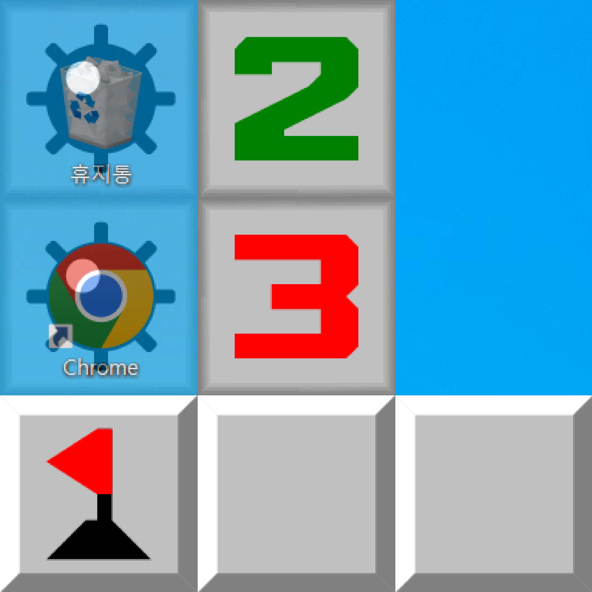

# DesktopMinesweeper
<hr>

[//]: # (![test]&#40;./src/logo.png&#41;{: width="100" height="100"})



### Play minesweeper with your icons in desktop! The icon would be deleted if you click mine block.

Developed by HeatOfFusion

<hr>

You can play this project now, but this project is still on development.

I'm optimizing the GUI system and ETC.

This project is developed for my display (3840X2160), so the program could perform bad in your Desktop.

I'll fix the problem when I'm free.

If you want to join this project, contact me by discord, my discord ID is heat_of_fusion.

<hr>

### Installation

This project is developed with Python 3.10.11, and I recommand you to make a new python virtual environment.

After cloning this project to your directory, press ```Win + r```, and type ```cmd```.

When the terminal appears, type the following command.

```pip install -r requirements.txt```

<hr>

### Run

After installing the all packages, type ```python DesktopMinesweeper.py``` on the terminal.

The program would scan your desktop and automatically make the block grid.

After the block cover your icons, click the blocks to recover your Desktop!

<hr>

### Credit

Product Manager: Jehyeon Park

Developer: Jehyeon Park

Design: Jehyeon Park

Special Thanks: Minhyeong Lee(Leecarry16)